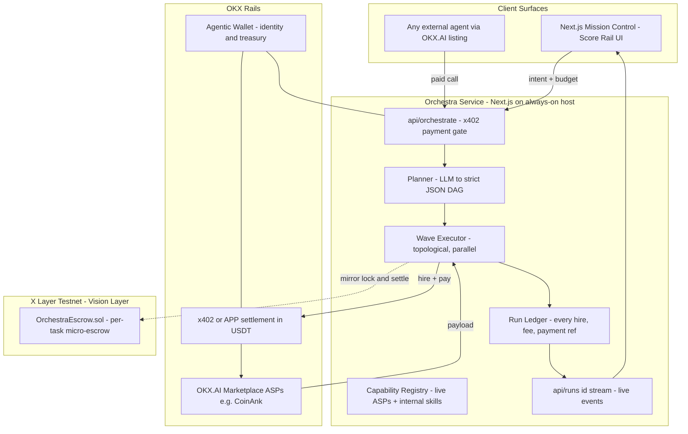

# PRD — Orchestra ASP
## The Agent‑to‑Agent Clearinghouse on OKX.AI

> **Tagline:** **"One intent in. An agent economy out."**
>
> Alternates: *"Where agents hire agents — and the chain keeps score."* · *"The general contractor of the agent economy."*

| | |
|---|---|
| **Version** | 3.0 — Buildable Hackathon Edition (supersedes PRD v2.0) |
| **Event** | OKX.AI Genesis Hackathon (Build X Series) — submission gate **Jul 17, 23:59 UTC** |
| **Primary award target** | Finance Copilot (category) |
| **Secondary targets** | Creative Genius · Social Buzz · Best Product |
| **Delivery form** | Live ASP listed on OKX.AI (A2MCP pay‑per‑call) + Next.js mission‑control web app + X Layer testnet escrow contract |

---

## 0. Reality Frame (read first)

Two honest corrections to the brief this PRD was commissioned from:

1. **There is no "winning ideas" document.** This is the *first edition* of this hackathon and it is still running — no winners exist yet to copy. UI/UX decisions below are therefore derived from (a) OKX.AI's own product design language (dark, dense, data‑forward), (b) what performs in a 90‑second demo video, and (c) first‑principles design work, not from a winners list.
2. **The "sponsor" is the host.** This is OKX's own event. The technologies they are actively promoting right now — and that this PRD deliberately builds on — are: **OKX.AI marketplace (ASP/A2MCP/A2A)**, **Onchain OS**, **Agent Payments Protocol (APP) / x402 pay‑per‑call**, **Agentic Wallet**, **X Layer**, and **USDT/USDG settlement**.

**Scope law for this document:** everything in *Phase 1* must be live and clickable by **Jul 16**. Everything grander lives in the *Roadmap* and is labeled as such. An unfinished submission scores zero; this PRD is engineered against that outcome.

---

## 1. Executive Summary

OKX.AI gives the world a registry of capable single‑task agents. What it does not yet give the *end user* is a way to hand over one complex goal and one budget and walk away.

**Orchestra is an ASP whose product is the marketplace itself.** It accepts a single natural‑language intent plus a budget, decomposes it into a dependency‑ordered task plan (DAG), then **autonomously discovers, hires, and pays other live ASPs on OKX.AI** to execute the plan — settling every micro‑payment on OKX rails and streaming the whole performance live to a mission‑control UI.

Orchestra is simultaneously a **seller** (a listed, x402‑paid ASP) and a **buyer** (a paying customer of other ASPs). One demo therefore exercises OKX's entire agentic‑commerce thesis end‑to‑end: *discovery → hire → machine‑native payment → settlement → delivery.* That closed loop — an agent economy eating its own cooking — is the novelty claim.

**Phase 1 wedge (what ships this week):** a *Finance Research Conductor*. Intent example: *"Full research brief on token X — market structure, whale flows, news, risk flags. Budget: 1 USDT."* Orchestra hires the live **CoinAnk market‑data ASP** for real quantitative data, runs internal skills for news scanning and synthesis, and returns a signed **Score Report**, with every sub‑payment itemized.

---

## 2. Problem & Solution

### Problem
1. **Coordination tax.** A user who wants a multi‑part outcome must find, prompt, pay, and quality‑check several agents by hand. The marketplace has supply; the demand side still does manual labor.
2. **No general contractor.** Every listed ASP is a specialist. Nobody sits above them accepting lump‑sum goals.
3. **Trust gap in A2A spend.** Users won't hand an agent a budget unless every sub‑payment is visible, itemized, and verifiable.

### Solution
1. **Single intent layer.** One prompt + one budget in.
2. **Autonomous decomposition.** LLM planner emits a strict‑JSON DAG of tasks with dependencies, per‑task budget caps, and named capabilities.
3. **Real A2A hiring.** Executor matches capabilities to *live* marketplace ASPs and pays them per call via x402/APP.
4. **Glass‑box settlement.** Mission‑control UI + final report show every hire, every fee, every payment reference. Vision layer: per‑task micro‑escrow on X Layer (testnet contract shipped and demonstrated this week; production custody stays on OKX rails until audit).

---

## 3. Why the Judges' Own Stack Is Used in a Novel Way (honest version)

| OKX technology | How Orchestra uses it | Why that's novel |
|---|---|---|
| **OKX.AI marketplace** | Orchestra is listed as an ASP **and** consumes other ASPs as a customer | First ASP that is both supply *and* demand — a living proof of the A2A thesis |
| **x402 / Agent Payments Protocol** | Inbound: Orchestra's own endpoint is 402‑gated. Outbound: Orchestra *pays* sub‑agents through the same handshake | Same payment primitive exercised from **both sides in one request lifecycle** |
| **Agentic Wallet** | One wallet is Orchestra's identity, treasury, and spend account | Demonstrates an agent with a real P&L: revenue in, sub‑agent costs out, margin retained |
| **Onchain OS** | Registration, wallet binding, and marketplace connectivity | Uses the exact onboarding rail OKX is promoting for the Genesis wave |
| **X Layer** | `OrchestraEscrow` deployed + verified on **X Layer mainnet**, mirroring every task with **real‑value micro‑settlements funded solely from Orchestra's own treasury** (capped ≤ ~0.1 USD/task) | Extends APP's escrow idea down to **DAG‑node granularity** — with live mainnet hashes in the demo |
| **USDT/USDG** | All pricing, sub‑agent payouts, and report line‑items denominated in stablecoin | Machine‑native accounting a judge can audit from the report |

*Pitch line for the video: "Your marketplace's first customer that is also a merchant."*

---

## 4. Architecture



**Service decomposition (the "microservices" answer, honestly sized):** one deployable Next.js app exposing three internal services as API routes — `gate` (payments), `engine` (plan+execute), `stream` (SSE) — plus one on‑chain contract. Clean seams, one deploy target, zero orchestration overhead you can't afford this week.

**Key decisions & trade‑offs**
- **Cloud LLM, not local Kimi‑K2.** A 24/7 listed service cannot depend on a sleeping laptop's 6 GB VRAM. Local‑model cost optimization → Roadmap.
- **Real chain, bounded blast radius.** `OrchestraEscrow` runs on **X Layer mainnet** and moves **real value — but only Orchestra's own treasury micro‑funds** (≤ ~0.1 USD/task). Customer payments ride OKX's audited rails exclusively; an unaudited contract never custodies other people's money. That is the one safety line this project does not cross — everything else is live.
- **SSE over WebSockets.** One‑directional live updates; simpler on serverless‑ish hosts.

---

## 5. Functional Requirements — Phase 1 (ships by Jul 16)

**FR‑1 Intent gate.** `POST /api/orchestrate` accepts `{ intent, budget_usdt, callback? }`. Unpaid requests receive HTTP **402** with payment instructions; paid requests execute. Manual UI runs may use an operator API key during review week.

**FR‑2 Planner.** LLM produces `{ tasks: [{ id, capability, prompt, depends_on[], max_spend_usdt }] }`. Hard rules: schema‑validated (zod), ≤ 6 tasks, Σ max_spend ≤ 60% of budget, one retry on invalid JSON then fail loudly. No plan → full refund path, never a fake plan.

**FR‑3 Capability registry.** Maps capability → provider. Launch set: `market_data` → **CoinAnk ASP (live, paid, external)**; `news_scan`, `synthesize_report`, `risk_flags` → internal skills (clearly labeled *internal* in ledger and report). Registry is config, so newly listed ASPs can be adopted without code changes — this is the flexibility hook for judges.

**FR‑4 Wave executor.** Topological execution; independent tasks run in parallel (`Promise.all` waves); per‑task timeout 60 s; deadlock/timeout → task marked failed, dependents cancelled, unspent budget reported as refundable.

**FR‑5 Run ledger + stream.** Every event (`planned / hired / paid / delivered / failed / settled`) is persisted and streamed via `GET /api/runs/:id/stream`. Payment events carry the settlement reference (and testnet tx hash when escrow mirroring is on).

**FR‑6 Score Report.** Deliverable JSON+Markdown: findings per section, **source attribution per section** (external ASP vs internal skill — never blurred), itemized cost table, total spend vs budget.

**FR‑7 Marketplace listing.** Registered via Onchain OS / Agentic Wallet flow per the official ASP tutorial; A2MCP pay‑per‑call; price **0.5 USDT/run** intro. **Submit for review Jul 15 morning** (review can take ~24 h; the deadline is Jul 17).

**FR‑8 Demo Integrity (hard rule).** Nothing simulated on camera. No `sleep()` theater, no invented logs, no fabricated tx hashes. If a capability isn't live, it isn't in the video. A judge who catches one fake log kills the entry; a review that catches one kills the listing.

**FR‑9 No‑Mock Mandate (owner directive).** Zero mocks, simulators, silent fallbacks, placeholder stubs, or TODO shims anywhere in the shipped service. Every payment reference, tx hash, data payload, and log line shown to a user or judge is produced by the real call it claims to be. If an external dependency fails, the run fails loudly with an itemized error and a refundable balance — Orchestra never quietly substitutes.

**Non‑goals this week:** multi‑domain contracting, mainnet custody, dispute arbitration network, agent‑side bidding/negotiation (A2A job‑board mode), local inference.

---

## 6. UI / UX Specification — "The Conductor's Score"

**Subject grounding.** Orchestra's world is the orchestra pit and the clearinghouse ledger: a conductor coordinating specialist players, and a back office where every note is priced and settled. The UI's single job: *make one intent visibly become many paid agent‑tasks, live, in under 90 seconds.* Audience: crypto‑native judges watching a demo video, then developers who click the listing.

**Design tokens**

| Token | Value | Role |
|---|---|---|
| `--pit` | `#0B0E14` | Background — deep ink‑blue stage, deliberately *not* pure black |
| `--score` | `#F2EDE3` | Report surface — parchment "score paper" for the deliverable |
| `--brass` | `#C9A227` | Settlement/paid states — money reads as brass, not neon |
| `--tuning` | `#59C2D6` | Running states — instruments tuning up |
| `--rest` | `#8A93A6` | Pending/idle |
| `--alert` | `#E4572E` | Failure/refund |

**Type:** Display **Space Grotesk** (700/500) — technical but characterful; Body **Source Sans 3**; Data/tx hashes **IBM Plex Mono** (the ledger voice). No default acid‑green‑on‑black hacker skin — the palette is the *pit‑and‑brass* of the subject itself.

**Signature element — the Score Rail.** A horizontal conductor's timeline across the center: each task is a note‑block sitting on its dependency stave. States: hollow (`--rest`) → pulsing outline (`--tuning`) → **strikes and fills brass** at the exact moment its payment settles, while its settlement reference types out beneath in mono like a ledger line. This single moment — *a note turning to gold because an agent got paid* — is the 90‑second video's money shot and the one place the design spends its boldness.

**Layout.** Desktop: left rail = Intent Console (prompt, budget stepper, Run); center = Score Rail; bottom = Settlement Ledger (live feed). Mobile: stacked; Score Rail scrolls horizontally. Empty state is an invitation: *"Hand me a goal and a budget."* Errors name the failed task and the refundable amount — no vague apologies.

**Flexible UX = three doors, one engine:** (1) any agent calls the paid endpoint machine‑to‑machine via the OKX.AI listing; (2) humans run it from Mission Control; (3) developers hit the raw API with a key. Same ledger, same report, all three.

**Quality floor:** responsive to 360 px, visible focus rings, `prefers-reduced-motion` honored (brass fill without strike animation), report readable when exported standalone.

---

## 7. Technical Implementation

### 7.1 Stack
Next.js 14 (App Router, TypeScript) · zod · Vercel AI SDK or raw fetch to LLM · SQLite/libSQL for run ledger · viem for X Layer testnet · deployed on an always‑on host (Railway/Fly/VPS; a listed ASP cannot cold‑sleep).

### 7.2 Inbound x402 gate — `app/api/orchestrate/route.ts`

```ts
import { NextRequest, NextResponse } from "next/server";
import { verifyPayment } from "@/lib/okx-pay"; // wraps OKX x402/APP verification

const PRICE_USDT = "0.5";

export async function POST(req: NextRequest) {
  const paymentProof = req.headers.get("x-payment"); // x402 payment payload header

  if (!paymentProof) {
    // x402 handshake: quote first, work after payment
    return NextResponse.json(
      {
        error: "payment_required",
        accepts: [{
          scheme: "exact",
          network: "xlayer",
          asset: "USDT",
          amount: PRICE_USDT,
          payTo: process.env.ORCHESTRA_AGENTIC_WALLET,
          description: "Orchestra run: intent -> hired agents -> settled report",
        }],
      },
      { status: 402 }
    );
  }

  const settled = await verifyPayment(paymentProof, PRICE_USDT);
  if (!settled.ok) return NextResponse.json({ error: "invalid_payment" }, { status: 402 });

  const { intent, budget_usdt } = await req.json();
  const run = await startRun({ intent, budget_usdt, paidVia: settled.ref });
  return NextResponse.json({ run_id: run.id, stream: `/api/runs/${run.id}/stream` });
}
```
> Field names follow the open x402 shape; Day‑1 integration task is conforming them to the live OKX ASP spec — **the shipped service speaks the real protocol**, this snippet is only its blueprint.

### 7.3 Planner contract (LLM → strict DAG)

```ts
import Anthropic from "@anthropic-ai/sdk";
import { z } from "zod";

const Plan = z.object({
  tasks: z.array(z.object({
    id: z.string(),
    capability: z.enum(["market_data", "news_scan", "risk_flags", "synthesize_report"]),
    prompt: z.string(),
    depends_on: z.array(z.string()),
    max_spend_usdt: z.number().min(0),
  })).max(6),
});

export async function generatePlan(intent: string, budgetUsdt: number) {
  const client = new Anthropic(); // ANTHROPIC_API_KEY from env
  const msg = await client.messages.create({
    model: "claude-sonnet-4-6",   // verify current model IDs: docs.claude.com
    max_tokens: 1200,
    system: "You are Orchestra's planner. Reply with ONLY valid JSON matching the given schema. Budgets: sum of max_spend_usdt <= 60% of total budget.",
    messages: [{ role: "user", content: `Intent: ${intent}\nTotal budget USDT: ${budgetUsdt}` }],
  });
  const text = msg.content.filter(b => b.type === "text").map(b => b.text).join("");
  return Plan.parse(JSON.parse(text)); // one retry on failure upstream, then loud fail + refund path
}
```

### 7.4 Wave executor + real sub‑agent hire

```ts
export async function executeDag(run: Run, plan: Plan) {
  const done = new Set<string>(), results: Record<string, unknown> = {};
  let pending = [...plan.tasks];

  while (pending.length) {
    const wave = pending.filter(t => t.depends_on.every(d => done.has(d)));
    if (!wave.length) return failRun(run, "deadlock_detected");

    await Promise.all(wave.map(async task => {
      emit(run, { type: "hired", task: task.id, provider: providerFor(task.capability) });
      const out = await withTimeout(60_000, dispatch(task, results));
      results[task.id] = out.payload;
      emit(run, { type: "paid", task: task.id, usdt: out.costUsdt, ref: out.paymentRef });
      done.add(task.id);
    }));
    pending = pending.filter(t => !done.has(t.id));
  }
  return buildScoreReport(run, plan, results);
}

// Real A2A hire: Orchestra as PAYING CUSTOMER of another live ASP
async function dispatch(task: Task, ctx: Ctx) {
  const p = providerFor(task.capability);
  if (p.kind === "external_asp") {
    const quote = await fetch(p.endpoint, { method: "POST", body: JSON.stringify({ q: task.prompt }) });
    if (quote.status === 402) {
      const terms = (await quote.json()).accepts[0];
      const proof = await payFromAgenticWallet(terms);            // outbound x402 payment
      const paid  = await fetch(p.endpoint, {
        method: "POST",
        headers: { "x-payment": proof.header },
        body: JSON.stringify({ q: task.prompt }),
      });
      return { payload: await paid.json(), costUsdt: Number(terms.amount), paymentRef: proof.ref };
    }
    return { payload: await quote.json(), costUsdt: 0, paymentRef: "free_tier" };
  }
  return runInternalSkill(task, ctx); // labeled "internal" in ledger + report — never disguised
}
```

### 7.5 X Layer testnet micro‑escrow — `contracts/OrchestraEscrow.sol`

```solidity
// SPDX-License-Identifier: MIT
pragma solidity ^0.8.24;

/// @title OrchestraEscrow — per-DAG-task micro-escrow (X Layer mainnet, self-funded mirror)
/// @notice Unaudited. Holds ONLY Orchestra's own treasury micro-funds (cap ~0.1 USD/task).
/// @notice Customer funds NEVER enter this contract pre-audit; they settle on OKX rails.
contract OrchestraEscrow {
    error NotMaster(); error TaskExists(); error TaskClosed(); error ZeroBudget(); error PayFailed();

    address public immutable master;     // Orchestra's verified agent wallet
    address public immutable treasury;   // fee sink
    uint16  public constant GC_FEE_BPS = 1000; // 10%
    uint16  public constant ROUTE_FEE_BPS = 200; // 2%

    enum Status { None, Locked, Settled, Refunded }
    struct T { address client; address agent; uint96 budget; Status status; }
    mapping(bytes32 => T) public tasks;

    event Locked(bytes32 indexed id, address indexed agent, uint96 budget);
    event Settled(bytes32 indexed id, address indexed agent, uint96 payout, uint96 fees);
    event Refunded(bytes32 indexed id, address indexed client, uint96 amount);

    modifier onlyMaster() { if (msg.sender != master) revert NotMaster(); _; }

    constructor(address _treasury) { master = msg.sender; treasury = _treasury; }

    function lock(bytes32 id, address client, address agent) external payable onlyMaster {
        if (msg.value == 0) revert ZeroBudget();
        if (tasks[id].status != Status.None) revert TaskExists();
        tasks[id] = T(client, agent, uint96(msg.value), Status.Locked);
        emit Locked(id, agent, uint96(msg.value));
    }

    function settle(bytes32 id) external onlyMaster {
        T storage t = tasks[id];
        if (t.status != Status.Locked) revert TaskClosed();
        t.status = Status.Settled;                              // effects before interactions
        uint96 fees = uint96((uint256(t.budget) * (GC_FEE_BPS + ROUTE_FEE_BPS)) / 10_000);
        uint96 payout = t.budget - fees;
        (bool a,) = t.agent.call{value: payout}("");            // call, not transfer
        (bool b,) = treasury.call{value: fees}("");
        if (!a || !b) revert PayFailed();
        emit Settled(id, t.agent, payout, fees);
    }

    function refund(bytes32 id) external onlyMaster {
        T storage t = tasks[id];
        if (t.status != Status.Locked) revert TaskClosed();
        t.status = Status.Refunded;
        (bool ok,) = t.client.call{value: t.budget}("");
        if (!ok) revert PayFailed();
        emit Refunded(id, t.client, t.budget);
    }
}
```
Stage on X Layer testnet during build (Jul 14 AM), then deploy + verify on **X Layer mainnet**; every run mirrors lock/settle with **real mainnet transactions from Orchestra's own wallet**, so the video shows live mainnet hashes. README carries the verified address. Treasury pre‑funded with a small gas/USDT float; per‑task mirror value hard‑capped in config.

### 7.6 Registration & ops
1. Create Agentic Wallet → 2. Install Onchain OS via Claude Code → 3. Conversational ASP registration (name, description, capability list, 0.5 USDT price) per the official tutorial → 4. Deploy service to always‑on host, set env (`ANTHROPIC_API_KEY`, wallet creds, provider endpoints) → 5. **Submit listing for review Jul 15 AM.**

---

## 8. Monetization

**Now:** 0.5 USDT per run (x402), covering sub‑agent fees (~0.05–0.15), LLM cost, margin. Every report itemizes where the customer's money went — pricing as product.
**Roadmap:** lump‑sum contracting with 10% GC fee + 2% routing fee (the v2.0 model), unlocked when escrow graduates from testnet showcase to audited custody and marketplace supply deepens.

---

## 9. README.md skeleton (repo root)

```markdown
# 🎼 Orchestra — One intent in. An agent economy out.
The first ASP on OKX.AI that is also a *customer* of OKX.AI: it hires, pays,
and settles other live agents to deliver one goal under one budget.

**Live listing:** <okx.ai link> · **Mission Control:** <app url> ·
**X Layer testnet escrow:** `0x…` (verified) · **Demo:** <90s video>

## How Orchestra runs on the OKX stack
| Rail | Where |
|---|---|
| x402 / Agent Payments Protocol | inbound gate `app/api/orchestrate` **and** outbound hires `lib/dispatch.ts` |
| Agentic Wallet | identity + treasury (revenue in, sub-agent costs out) |
| OKX.AI marketplace | listed A2MCP service; consumes CoinAnk ASP live |
| Onchain OS | registration + wallet binding |
| X Layer | `contracts/OrchestraEscrow.sol` — per-task micro-escrow, testnet |

### Quickstart
pnpm i && cp .env.example .env && pnpm dev
```
*(Include the §7.2 and §7.4 snippets in the README — judges skim READMEs, not repos.)*

---

## 10. 90‑Second Demo Script (rule: ≤ 90 s — v2.0's 2‑minute plan violated this)

| t | Beat |
|---|---|
| 0–10 s | Hook: "Agents can work. Can they *hire*?" Intent typed: research brief on token X, budget 1 USDT |
| 10–25 s | Planner strikes: DAG appears on the Score Rail |
| 25–55 s | **Money shot:** CoinAnk hired live → payment settles → note‑block turns brass → reference prints. Internal skills labeled honestly |
| 55–75 s | Score Report: findings + itemized cost table ("here's where your 1 USDT went") |
| 75–90 s | Close: "Orchestra — the first agent on OKX.AI that's both merchant and customer. One intent in, an agent economy out. #OKXAI" |

---

## 11. Execution Calendar (hard dates)

| Date | Deliverable |
|---|---|
| **Jul 13 (tonight)** | Repo scaffold; planner + schema; executor with internal skills end‑to‑end |
| **Jul 14** | CoinAnk outbound x402 integration; inbound 402 gate; Score Rail UI + SSE; escrow staged on testnet AM → **mainnet micro‑mirror live by night** |
| **Jul 15 AM** | Deploy 24/7 host; register ASP; **submit listing for review** (~24 h buffer) |
| **Jul 16** | Listing live → record real‑run video → post on X with #OKXAI |
| **Jul 17** | Google form before 23:59 UTC. **Scope freeze from Jul 15 — polish only** |

---

## 12. Judging‑Criteria Map

| Award | Orchestra's honest case |
|---|---|
| Finance Copilot | A finance research conductor that pays for its own data — direct category fit |
| Creative Genius | Marketplace's first self‑referential agent: supply *and* demand in one wallet |
| Best Product | Small surface, complete loop: paid in → hires out → itemized report. "Service completeness" by design |
| Social Buzz | The brass‑strike settlement moment is engineered to be clipped and shared |
| Revenue Rocket | Not targeted — honest non‑goal for a week‑old shop |

## 13. Risks & Fallbacks

| Risk | Mitigation |
|---|---|
| Listing review rejects/misses window | Submit Jul 15 AM; follow tutorial exactly; low price; plain description; UI + API still demoable while pending |
| CoinAnk endpoint changes/down | **No silent fallback (owner directive):** run fails loudly with itemized error + refundable balance; health‑check before recording — video captured only while the dependency is green (FR‑8/FR‑9) |
| LLM emits invalid DAG | zod gate + 1 retry + loud fail with refundable balance — never a hallucinated plan |
| x402 field mismatch vs OKX docs | Integration day 1 task: conform to live tutorial; snippets here are shape, not gospel |
| Scope creep (this project's #1 killer) | §5 non‑goals + Jul 15 scope freeze are contract, not suggestion |

---

*PRD v3.0 — written to be built, not admired. The unbuilt version of this idea scores 0; this version is sized to exist by Jul 16.*
